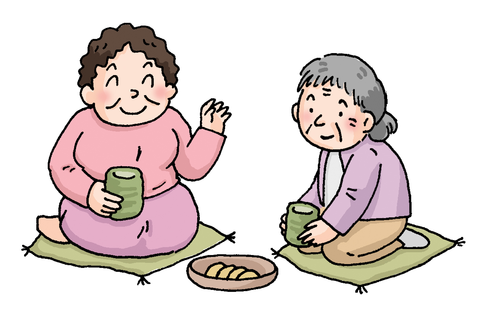
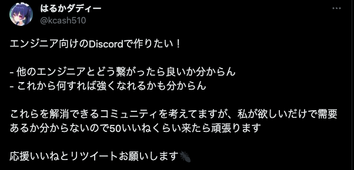
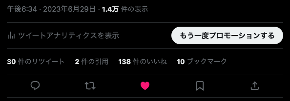
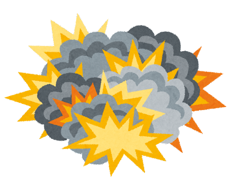
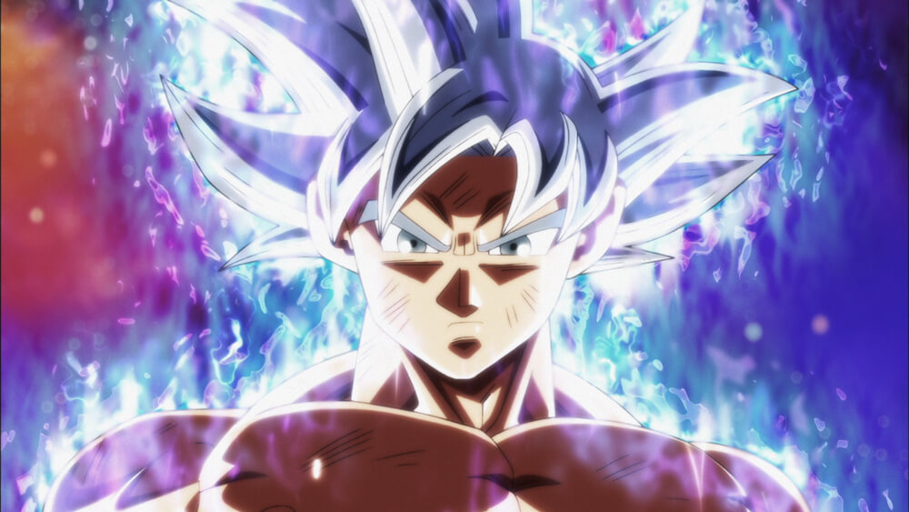

# 第1回 なんちゃって発表会

お集まりいただきありがとうございます。

---

# 楽しんでいただくために

- 自由に後退出おっけーです。
- コメント欄あるのでよかったら感想とか思ったこととか書いてください！
- 質問は手を挙げて参加してもらってコメントするか話してもらえるとありがたい
- 録画してアーカイブする予定です。
- 誹謗中傷や価値観の押し付けなどは楽しくやるためにも避けていただけますと幸いです。

---

# 孤独すぎて自分のためのコミュニティを作った話

---

<!-- _header: 自己紹介 -->

## 自己紹介

- 名前：遥
- このコミュニティ作ってる人
- 職業：無職ニート（一応エンジニア脂肪）
- 年齢：26歳
- 家族構成：子持ち
- 人生詰みそう

### Links

[@hulk510](https://github.com/hulk510)

---

今日話すこと

## コミュニティを作った経緯とかを適当に。

### 目次

1. 孤独
2. 初動
3. 身勝手の極意
4. 破壊と再生

---

# 序章: 孤独

## コミュニティを作りたくなった経緯

---

<!-- _header: 孤独 -->

何もできてない、話せる人いない

# 寂しい。。。。

しょーもないものでもいいから何か作ったら見てもらいたい！！
でもTwitterで出すとなんか言われたら辛い...

---

<!--
_header: 孤独
 -->

> 天才は常に孤立して生まれ、
> 孤独の運命を持つ
> ヘルマン・ヘッセ

# 孤独は天才に必要なのか。💡

---

<!--
_class: center
_header: 孤独
 -->

# 知らんがな

---

<!--
_color: #F5F5F5
_header: 孤独
 -->

# とにかく話せる相手が欲しい。

# SOREDAKE!!!

---

# 第二幕 初動

## コミュニティの作成

---

<!-- _header: 初動 -->

# さっそくTwitterで募集をかけてみた

正直作ることは決めてたが、
チキってみんなが作ってもいいよって形にしてみました。

---

<!-- _header: 初動 -->

# 結果...

---

<!-- _header: 初動 -->

# 思ってたより結構反応きた

ブックマークしてるひとは何のために笑

---

<!-- _header: 初動 -->

# みんなたぎってるやん🔥

行った手前、引くに引けない🤒

---

<!--
_backgroundColor: white
_color: default
_header: 初動
-->

# まぁ、みんながいいって言ったからヨシ！

---

<!--
_backgroundColor: white
_color: default
_header: 初動
-->

# MMMM爆誕

---

# 第3局 身勝手の極意

## エンジニアを勘違いしていた話

---

<!-- _header: 身勝手の極意 -->

# 作って1ヶ月、思いの他良き丸水産である。

## 特に思ったことは

1. エンジニアは優しい。
2. 色んなバックグラウンドの人がいて面白い
3. アウトプットに反応あるの嬉しい

---

<!-- _header: 身勝手の極意 -->

# 1. エンジニアが優しい

勝手に誤解していたが、
言葉に棘があったり他人を批判したりする人ばかりだと思っていた。

## 蓋を開けてみると、みんな優しい

最近ちょくちょく仕事の悩みとか呟いてそれに対して誰かが回答してたり。
まぁ、まだ人数少ないから平和ってのもあるのかもしれないけどね。😁

---

<!-- _header: 身勝手の極意 -->

# 2. 色んなバックグラウンドの人がいて面白い

- ## 話見てると「はえーこんな世界あるんや」ってなれる。

- ## 集まってこんなLT会みたいなの開けてることが面白い

- ## 各々好きな領域が違ってるのが新鮮

---

<!-- _header: 身勝手の極意 -->

# 3. アウトプットに反応あるの嬉しい

### アウトプットして、返信してくれたりするとうれピィー！

### 次のアウトプットのために頑張りたいってなる。

---

<!-- _header: 身勝手の極意 -->

# え、普通にエンジニアと話すのおもろいやん🤔

## オラ、ワクワクすっぞ！

---

# 終幕 破壊と再生

## 最後にコミュニティのあり方について

---

<!-- _header: 破壊と再生 -->

- # 自由にアウトプットできる場にしたい。

  あれできたよ、これできたよ、こういうのあるみたいとかなんでも気軽に投稿できたらいいな。技術ばかりでもなく、それこそエンジニアとしてどう言ったことをやっていくべきかとか好きな食べ物の話とか色んな話題について載せたりできたら良いなと思う。

  ワイが発表会とかハッカソンに出るための練習場として使いたいしエンジニアと繋がって話せる場にしたい。

---

<!-- _header: 破壊と再生 -->

- # もっと反応欲しい（承認欲求）

  ## ワイはもっとスタンプ欲しい!!!!

  💩でも🤠←これとかいつ使うかわからないものでもなんでもOK！
  あと他の人の投稿に関しても別につけて絵文字だらけにしたい。

  ### 圧倒的！承認欲求!!!

---

<!-- _header: 破壊と再生 -->

# 今後やりたいなってものをいくつか（いつか）

- なんちゃってハッカソン
- なんかコードレビュー
- 気分で輪読会
- 技術トーク
- オフラインの交流会

> こういうのやりたいも是非是非お待ちしておりますぞ。
> [サーバーへの意見＆相談](https://discord.com/channels/700938549251407914/1124329150212210778)までご意見お待ちしておりまする。

---

# 最後に一言

家にずっといるとネガティブになってくるので定期的にお外に出るのも大切かなと最近思いました。

## 暑いから出たくないけど。

---

# ご清聴ありがとうございました。

初めてのスライド作成思いのほか楽しかったです。
