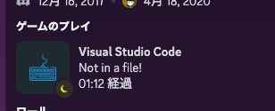

<!--
_color: white
_footer: 'Photo by Benjamin Rascoe on Unsplash'
-->

# タイトル全面背景

Brightnessを落とし、文字の視認性を上げました

---

<!--
_footer: 'Photo by Michal Vasko　on Unsplash'
paginate: true
-->

## 左に画像をいれる

- 表示場所、比率を指定する
- 次頁では、複数画像を並べます
- footerで画像クレジット表示も

---

<!--
_backgroundColor: white
_footer: 'Photo by Chris Campbell, Dan on Unsplash'
-->

# 進め、

#### 新しいわたし。

なんて、
小洒落た感じにも。

---
